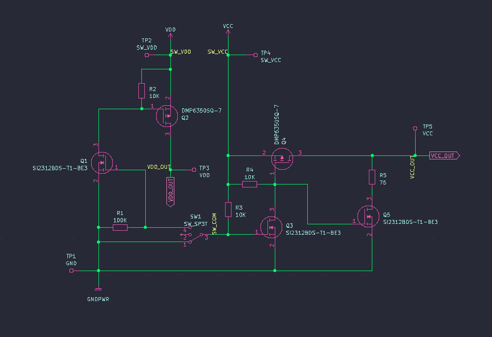

# mgl_switch

This is a replacement switch for the Game Boy Light. The original MGL switch is an unusual 3PDT for which a suitable replacement isn't currently known. This design uses a standard 3PST switch and mosfets to replicate the ability to turn on the system and back light with a single switch.

# Manufacturing information

- PCB type: Flex
- PCB thickness: 0.11mm
- Layers: 2
- Stiffener: 0.2mm PI(see user comments layer)
- 3M tape: 3M9077(see user comments layer)

# Schematic

A PDF version of the schematic can be found in the `artifacts` directory.