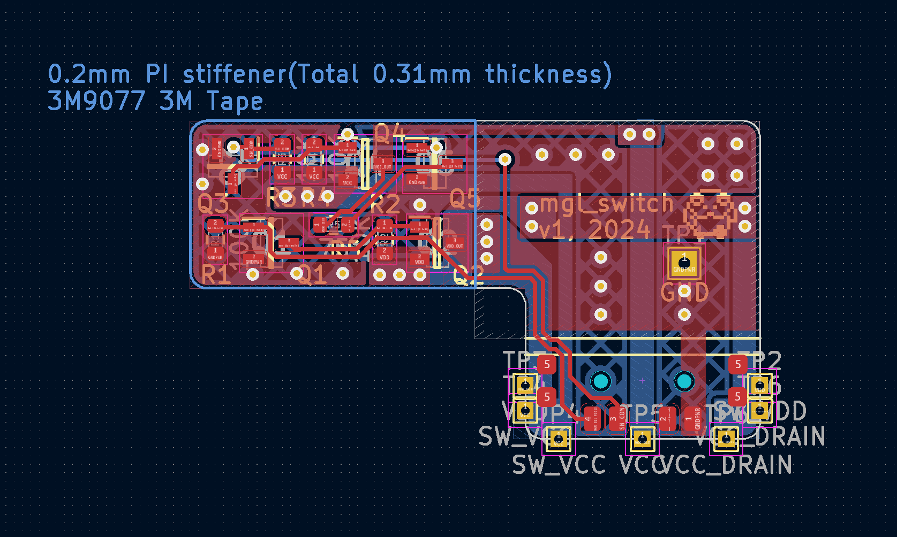
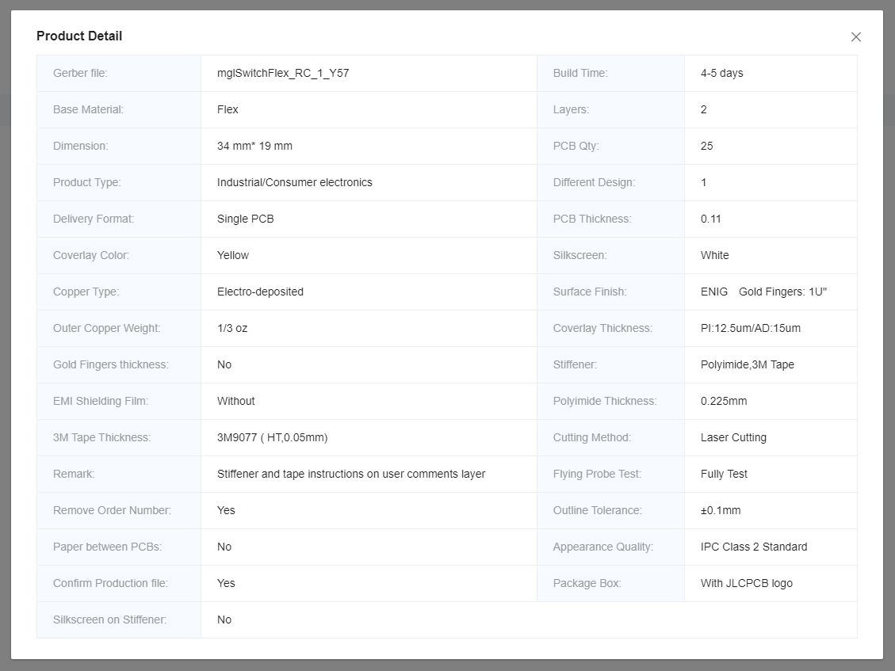

# mgl_switch

This is a replacement switch for the Game Boy Light. The original MGL switch is an unusual 3PDT for which a suitable replacement isn't currently known. This design uses a standard 3PST switch and mosfets to replicate the ability to turn on the system and back light with a single switch.

# About this repo
This repo consists of three main components:
- Kicad 7 source files(in `root`)
- PDF schematic(in `artifacts`)
- Gerbers(in `artifacts`)

# Manufacturing information
To make it easy to assemble this project, the gerbers for the current version can be found in `artifacts` and uploaded at your PCB fabricator of choice, e.g. JLCPCB. For best results, follow these paramters:
- PCB type: Flex
- PCB thickness: 0.11mm
- Layers: 2
- Stiffener: 0.2mm PI(see user comments layer)
- 3M tape: 3M9077(see user comments layer)

Below is a screenshot of the complete order parameters from JLCPCB:

<a property="dct:title" rel="cc:attributionURL" href="https://github.com/leggomyfroggo/mgl_switch">mgl_switch</a> by <a rel="cc:attributionURL dct:creator" property="cc:attributionName" href="https://github.com/leggomyfroggo">Chris Hackmann</a> is licensed under <a href="https://creativecommons.org/licenses/by-nc/4.0/?ref=chooser-v1" target="_blank" rel="license noopener noreferrer" style="display:inline-block;">CC BY-NC 4.0</a>
